# DNSTools for macOS

**The ultimate hybrid DNS analysis utility for Mac.**
*Fast, Native, and Privacy-Focused.*

  

## 🚀 Overview
DNSTools is a powerful menu bar utility that bridges the gap between local terminal commands and cloud-based API analysis. Designed for network engineers, sysadmins, and web developers who need instant answers without context switching.

**Dual Engine Technology:**
1.  **Local Native Mode:** Runs local `dig`, `ping`, `trace`, and `whois` commands directly on your machine. Zero latency, unlimited usage, completely private.
2.  **MXToolbox API Mode:** Seamlessly integrates with the MXToolbox API to provide advanced blacklist monitoring, deep health checks, and standardized reporting.

## ✨ Key Features
* **Menu Bar Access:** Always one click away. Instant visibility into network health.
* **Smart History:** Automatically logs every search locally using SwiftData. Searchable, filterable, and exportable to CSV.
* **Hybrid Resolver:**
    * Force Local lookups via **Cloudflare (1.1.1.1)**, **Google (8.8.8.8)**, or your own **Custom DNS**.
    * Verify global propagation by switching between local ISP and cloud resolvers.
* **25+ Record Types:** Support for A, AAAA, MX, TXT, CNAME, SOA, NS, PTR, and advanced security records (SPF, DKIM, DMARC).
* **Pro Tools:**
    * **WHOIS:** Smart parsing of registrar data and nameservers.
    * **Trace Route:** Visual hop-by-hop analysis.
    * **SSL/Headers:** Quick HTTP status and header checks.

## 🛠 Installation

### Option 1: Build from Source
1.  Clone this repository.
2.  Open `DNSToolsMenu.xcodeproj` in Xcode 15+.
3.  Disable "App Sandbox" in *Signing & Capabilities* (Required for local shell commands).
4.  Build and Run (⌘R).

### Option 2: Download Release
         Go to the [Releases Page](../../releases) and download `DNSToolsMenu-v{#version#}.zip`.
*Note: Since this app interacts with system shell commands, you may need to Right-Click > Open the first time you run it.*

## 📸 Screenshots

### 🖥️ Main Interface & Tools
The app lives in your menu bar, providing instant access to DNS tools and usage stats.

| **Main Menu** | **Tool Selection** | **API Usage Badge** |
| :---: | :---: | :---: |
|  | 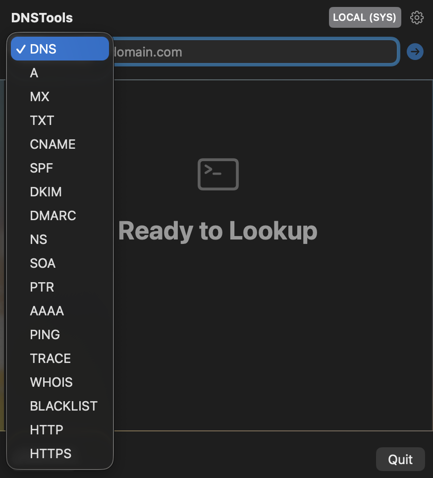 | 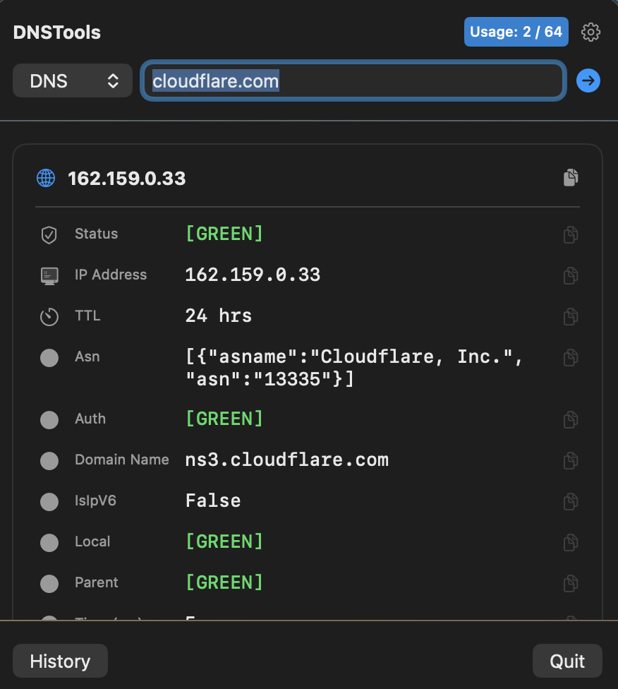 |
| *Clean native macOS interface* | *Quick access to 15+ DNS commands* | *Track API limits at a glance* |

### ⚡️ Dual-Engine Power
Switch between using your local ISP/System DNS or force a specific resolver to check propagation.

| **Local (System DNS)** | **Local (Custom - 8.8.8.8)** |
| :---: | :---: |
| 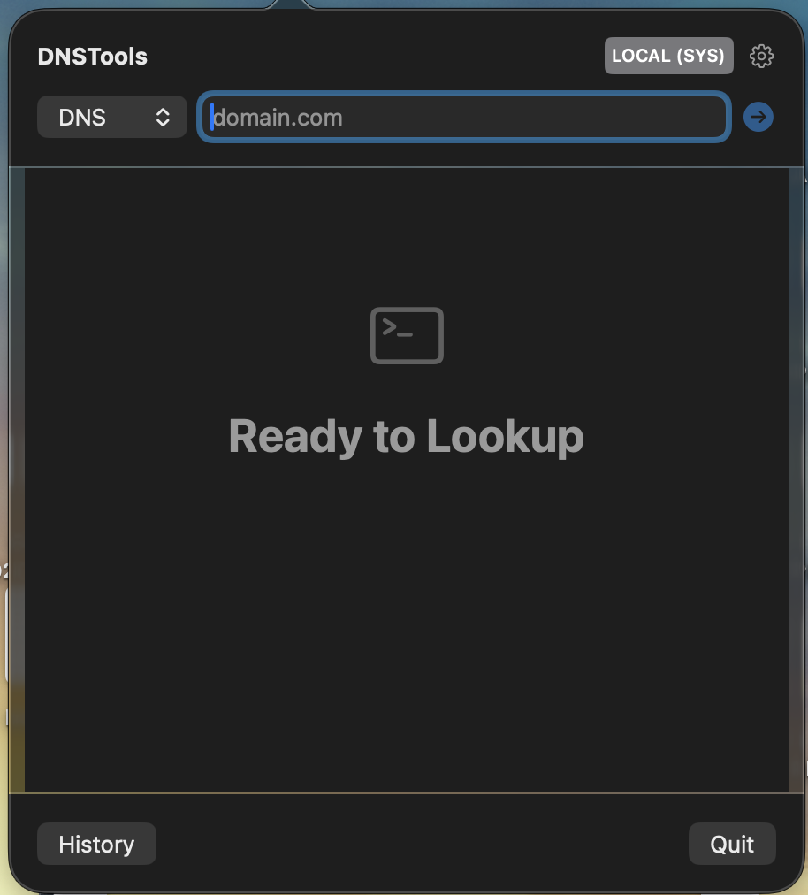 | 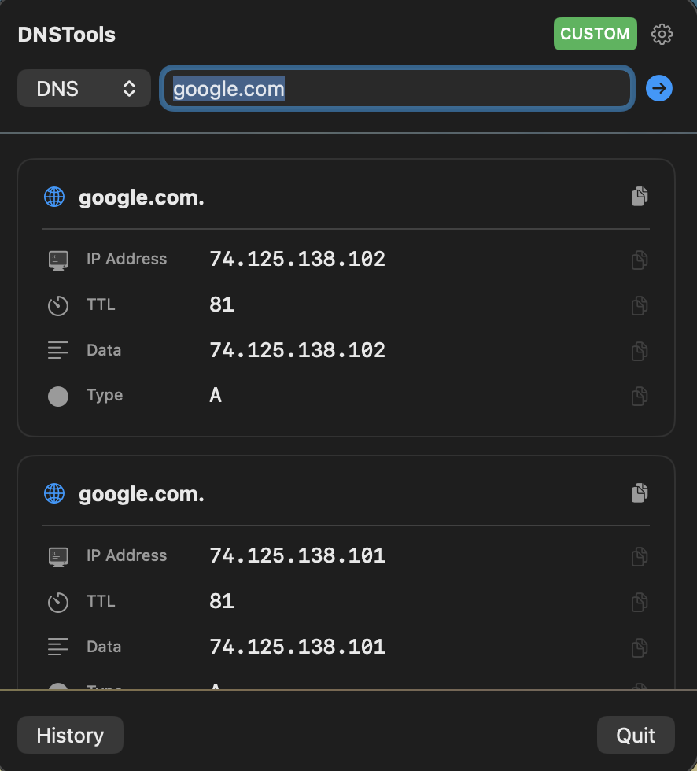 |
| *Standard lookup using system settings* | *Forcing a lookup via Google DNS* |

### ⚙️ Advanced Configuration
Customize your experience with the Hybrid Engine settings.

| **General Settings** | **Resolver Options** | **Custom IP Input** |
| :---: | :---: | :---: |
| 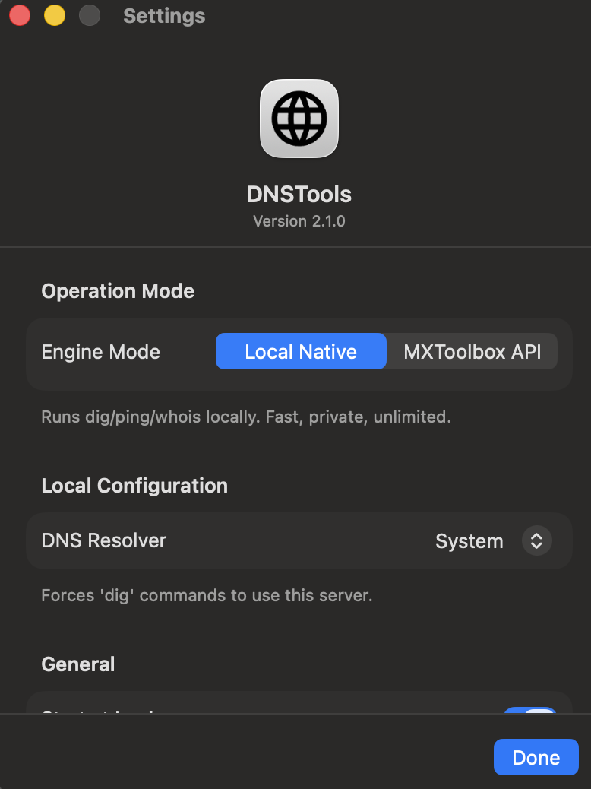 | 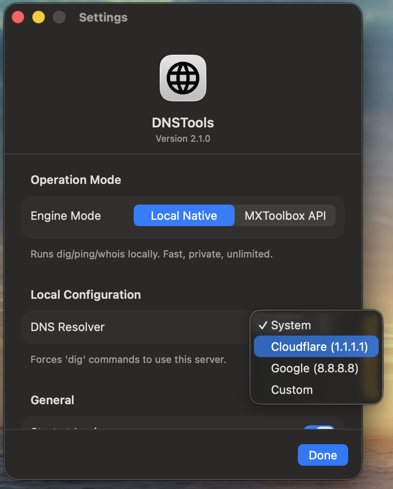 | 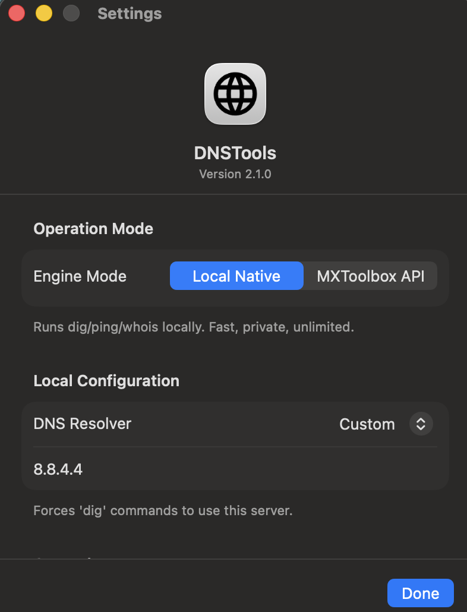 |

| **MXToolbox API Setup** | **API Key Management** | **App Preferences** |
| :---: | :---: | :---: |
| 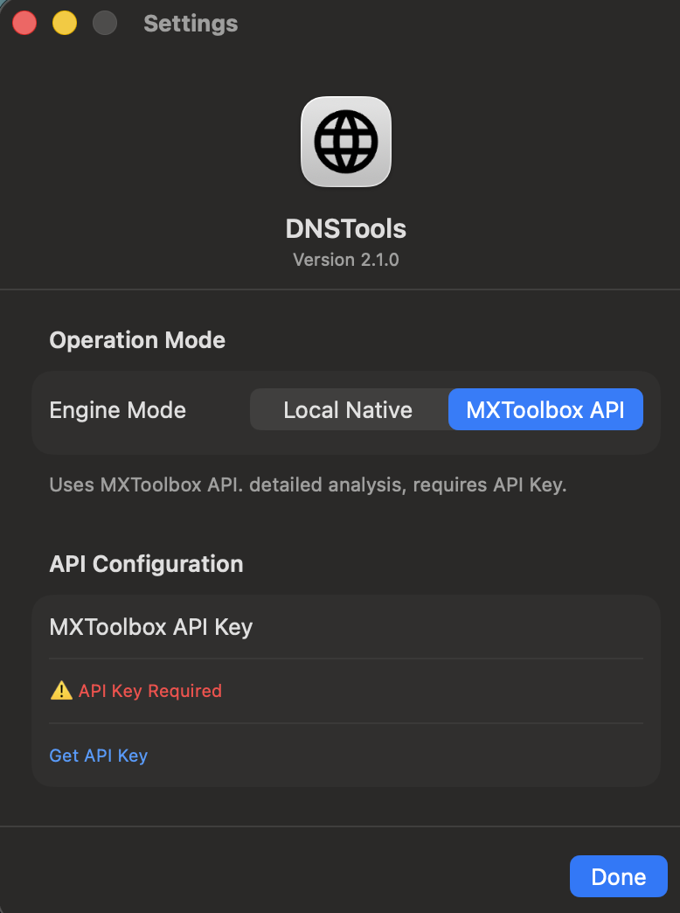 | 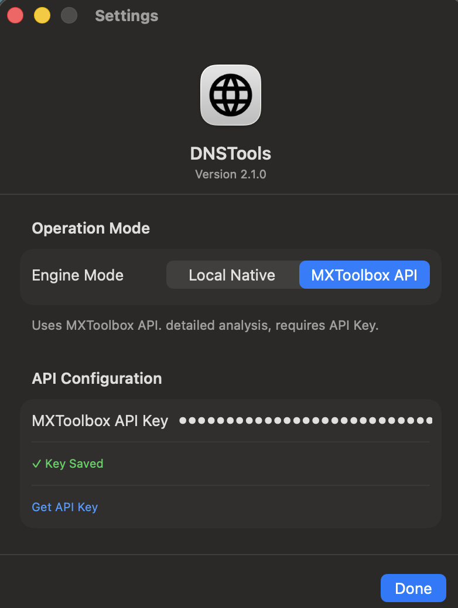 | 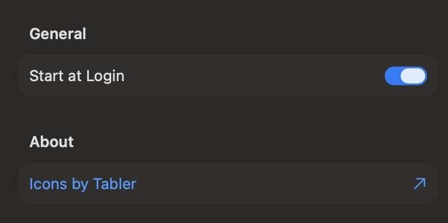 |

### 📜 Search History
Automatically log every query. Search, filter, and export your history to CSV.

| **History View** | **Filtered Results** |
| :---: | :---: |
| 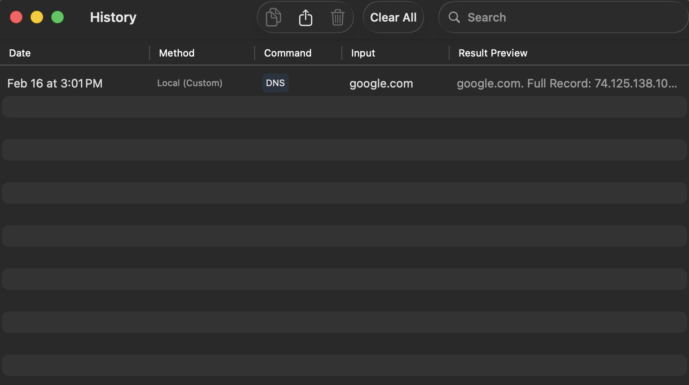 | 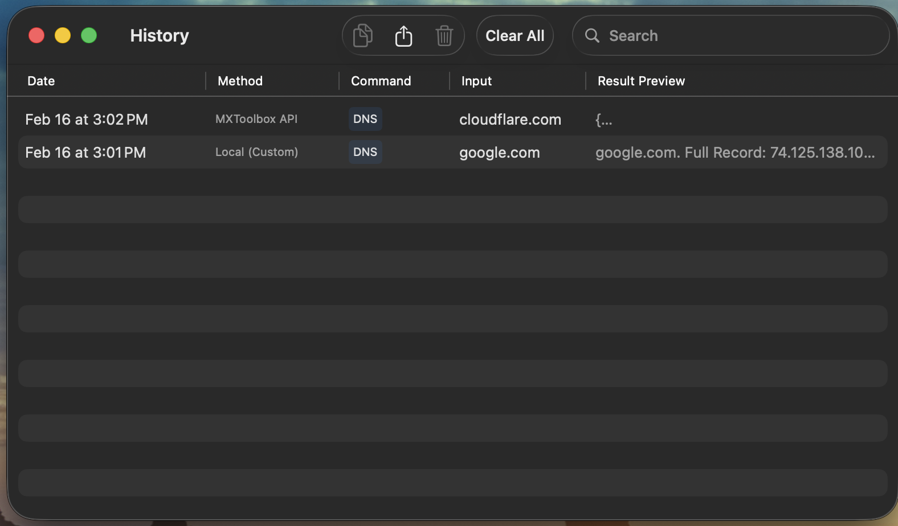 |
| *Detailed log of all queries* | *Search by domain or record type* |

## ⚙️ Configuration
* **Start at Login:** Toggle auto-launch in Settings.
* **API Key:** (Optional) Add your MXToolbox API key to unlock the Cloud Engine.
* **Custom DNS:** Route local `dig` requests through a specific IP address to test split-horizon DNS or internal servers.

## 📜 License & Attribution
This project is free to use and modify for personal or commercial purposes, provided that **attribution is maintained**.

If you use this source code in your own projects, you must include a reference to the original author [Anthony White](https://github.com/antwonw/) and this repository.

* **Icons:** [Tabler Icons](https://tabler.io/icons) (MIT License)
* **Engine:** Built with SwiftUI & SwiftData.

---
*Built with ❤️ in Swift.*
